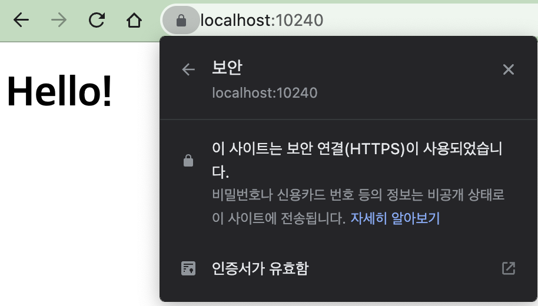

# Introduction
**Infinition** is a fast media contents viewer application supporting infinite scroll 

## Requirements
 \
 \

 

### Apply HTTP/2 or HTTPS

Use [mkcert](https://github.com/FiloSottile/mkcert#installation) for generating SSL key, cert files. \
Refer to [How to use HTTPS in localhost](https://web.dev/i18n/ko/how-to-use-local-https/)

